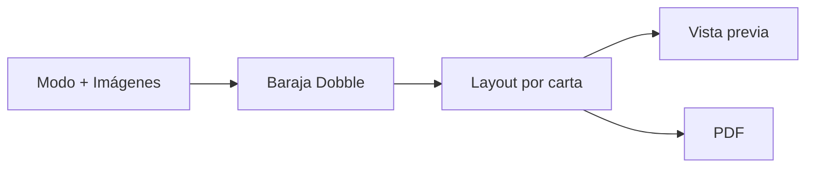
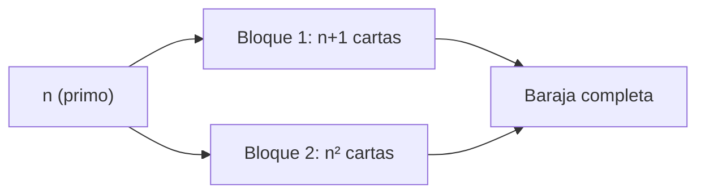
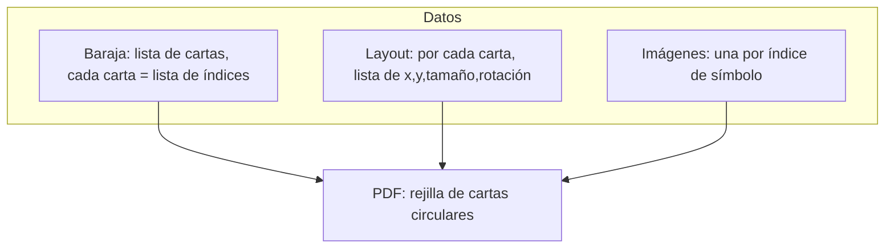

# Cómo está hecho el generador Dobble (Spot It)

Guía para entender la lógica del proyecto y poder replicarlo en cualquier lenguaje o plataforma.

---

## Qué hace la aplicación

1. El usuario elige un **modo** (cuántas cartas y símbolos por carta).
2. Sube **imágenes** (una por símbolo).
3. Se genera una **baraja Dobble**: cada par de cartas comparte **exactamente un** símbolo.
4. Se calcula la **posición** de cada símbolo dentro de cada carta (círculo).
5. Se exporta todo a **PDF** para imprimir.



---

## 1. Generar la baraja Dobble

La baraja se basa en un **plano proyectivo finito** de orden **n** (n primo: 2, 3, 5, 7, 11…).

**Fórmulas:**

- Cartas totales = **n² + n + 1**
- Símbolos totales = **n² + n + 1**
- Símbolos por carta = **n + 1**

**Ejemplos:**

| n (orden) | Cartas | Símbolos por carta |
|-----------|--------|---------------------|
| 2 | 7 | 3 |
| 3 | 13 | 4 |
| 5 | 31 | 6 |
| 7 | 57 | 8 |
| 11 | 133 | 12 |

**Algoritmo (dos bloques):**



- **Bloque 1** — Primeras **n+1** cartas:
  - Todas llevan el símbolo **0**.
  - Carta i (i de 0 a n): además tiene los símbolos `1+i*n, 2+i*n, ..., n+i*n`.
  - Ejemplo n=2: carta0 = [0,1,2], carta1 = [0,3,4], carta2 = [0,5,6].

- **Bloque 2** — Restantes **n²** cartas:
  - Para cada par (i, j) con i,j de 0 a n-1, una carta con:
    - Símbolo **i+1**
    - Para k de 0 a n-1: símbolo = **n + 1 + n*k + (i*k + j) mod n**

**Pseudocódigo:**

```
generar_baraja(n):
  cartas = []
  // Bloque 1
  para i de 0 a n:
    carta = [0]
    para j de 0 a n-1:
      carta.añadir(1 + j + i*n)
    cartas.añadir(carta)
  // Bloque 2
  para i de 0 a n-1:
    para j de 0 a n-1:
      carta = [i+1]
      para k de 0 a n-1:
        carta.añadir(n + 1 + n*k + (i*k + j) mod n)
      cartas.añadir(carta)
  devolver cartas
```

Cada carta es una lista de índices de símbolo (0 a n²+n). Esos índices se usan después para asignar imágenes.

---

## 2. Colocar símbolos dentro de cada carta (layout)

Cada carta es un **círculo**. Hay que colocar varios símbolos (círculos pequeños) dentro sin que se solapen demasiado.

**Idea:** simulación de **fuerzas** (force-directed):

- Cada símbolo se atrae hacia el **centro** de la carta.
- Si dos símbolos se solapan, se **repelen**.
- Si un símbolo se sale del borde del círculo, una fuerza lo empuja **hacia dentro**.
- Opcional: si hay mucha presión (solapamiento), se puede **reducir un poco el tamaño** del símbolo (“breathing”).

Se repite el cálculo de fuerzas y se actualizan posiciones muchas veces (p. ej. 80 iteraciones) hasta que se estabiliza. Así se obtiene para cada símbolo: posición (x, y), tamaño (ancho/alto) y rotación.

**Resumen:**

- Entrada: lista de índices de símbolos de la carta, radio del círculo de la carta.
- Salida: lista de “placements”: por cada símbolo, (x, y, ancho, alto, rotación en grados).

Para que el resultado sea reproducible (misma carta = mismo layout), usa un generador de números aleatorios con **semilla** (p. ej. semilla = “carta_” + índice de carta).

---

## 3. Imágenes

- El usuario sube **n² + n + 1** imágenes (una por símbolo).
- Conviene **redimensionar** (p. ej. que ningún lado pase de 800 px) para no cargar archivos enormes.
- Guardar cada imagen en un formato que puedas usar tanto en pantalla como al generar el PDF (p. ej. data URL, ruta temporal, buffer en memoria).

---

## 4. Exportar a PDF

- **Página:** A4, márgenes (p. ej. 15 mm).
- **Cartas:** círculos de tamaño fijo (p. ej. 87 mm de diámetro), separados por un hueco (p. ej. 2 mm).
- Calcular cuántas cartas caben por fila y por columna; colocar las cartas en una rejilla.
- Por cada carta: dibujar un círculo y, usando el layout de esa carta, dibujar cada símbolo en su (x, y) con su tamaño y rotación, escalando desde las coordenadas del layout al tamaño real de la carta.

Puedes generar el PDF dibujando directamente (librería PDF de tu lenguaje) o, en web, renderizar la página en un canvas y pasar cada página al PDF.



---

## Resumen: pasos para hacer tu propio generador

1. **Baraja:** Implementar el algoritmo del plano proyectivo (Bloque 1 + Bloque 2) con n primo. Resultado: array de cartas, cada carta = array de índices de símbolo.
2. **Layout:** Por cada carta, simular fuerzas (centro + repulsión + borde) para obtener (x, y, tamaño, rotación) de cada símbolo. Usar semilla por carta para repetir el mismo layout.
3. **Imágenes:** Asociar una imagen a cada índice de símbolo; redimensionar si hace falta.
4. **Vista previa:** Dibujar cada carta como círculo y colocar cada símbolo según su placement (escalando al tamaño de la carta).
5. **PDF:** Mismas posiciones y escalas que en la vista previa, pero en coordenadas de impresión (rejilla en A4) y exportar a PDF.

Con esto puedes reimplementar el generador en cualquier lenguaje (Python, JavaScript, C#, etc.) o plataforma (web, escritorio, app).
